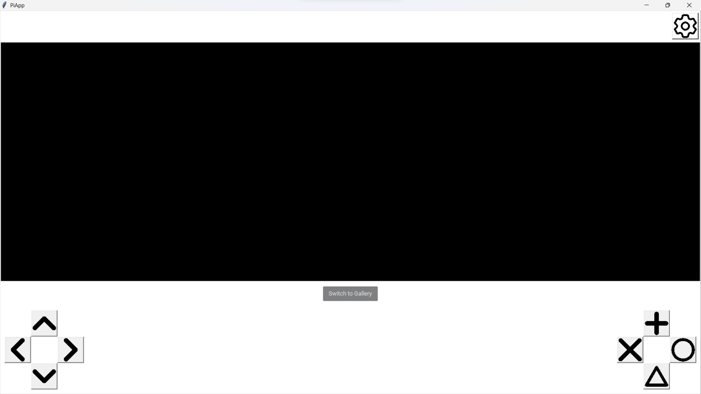
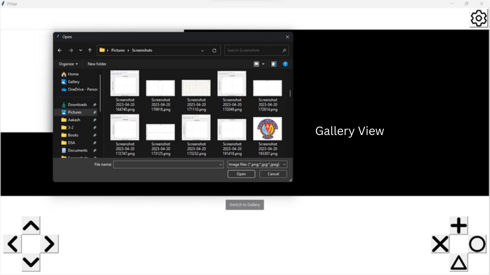

# Rpi-Robot

## Description

Rpi-Robot is a project designed to provide a GUI interface for controlling a robot or device, primarily intended for deployment on a Raspberry Pi. With its intuitive interface, users can issue movement commands, view device status, and adjust settings.

## Features

- **Graphical User Interface (GUI)**: Built with `tkinter`, the interface provides clear visual feedback and easy-to-use controls.
- **Movement Controls**: Directional buttons for Up, Down, Left, and Right movements.
- **Settings**: Accessible settings panel for configuration.
- **Error Handling**: Robust error handling capabilities for smoother user experience.

## Getting Started

### Prerequisites

- Python 3.x
- Libraries and modules to install:
  - `tkinter`
  - `customtkinter`
  - If deploying on Raspberry Pi, ensure to have `RPi.GPIO` module installed.

### Installation

1. Clone this repository.
2. Navigate to the project directory.
3. Install the required libraries and modules.
4. Run `MainActivity.py` to start the application.

```
python MainActivity.py
```

### Usage

Follow the steps below to set up and utilize the Rpi-Robot:

1. **Initial Setup**:

   - Ensure you're working on a Raspberry Pi (Rpi) device.
   - Install the necessary libraries and modules as mentioned in the "Prerequisites" section.

2. **App Verification**:

   - Before connecting any external components, verify that the app is running smoothly on the Rpi.

3. **LCD Screen Connection**:

   - Connect an LCD screen to your Rpi.
   - Run the app and you should be able to see the interface displayed on the screen.

4. **Robot Connection**:

   - Connect the GPIO pins on your Rpi to the robot.
   - Ensure the connections are secure and correct to avoid any damage or malfunction.

5. **Camera Access**:

   - Access the robot's camera to get its view.
   - The camera view can be displayed on the LCD screen, allowing you to see from the robot's perspective.

6. **Control and Interaction**:
   - Use the **Movement Buttons** to control the robot's direction and movement.
   - Utilize the **Command Buttons** to give specific commands to the robot.
   - Click pictures using the camera view option.
   - Toggle between the **Display Screen** and **Gallery** to view clicked images.
   - The **Gallery** stores all the captured images and lets you browse through them.

With these steps, you can effectively control the robot, access its camera view, and interact with various functionalities of the Rpi-Robot.

## Screenshots






## Directory Structure

- **MainActivity.py**: Serves as the main entry point and orchestrator for the Rpi-Robot's GUI and functionalities.
- **Assets**: Contains images and icons used in the GUI.
- **Controller**:
  - **Repository.py**: Responsible for data or interactions with some data store or hardware.
- **Presentation**: Manages user interactions and display components.
  - **view**: Contains various components related to the user interface such as buttons and displays.
    - **ArrowButton.py**: Defines a button with an arrow shape, used for directional commands or navigation.
    - **CircularButton.py**: Describes a button with a circular shape, for specific actions.
    - **ControllerButton.py**: Defines a button related to controlling some functionality.
    - **DisplayScreenWidget.py**: Manages a display that can either show DisplayScreen or Gallery.
    - **ImageButton.py**: Describes a button that uses an image as its label.
    - **RectangularButton.py**: Defines a button with a rectangular shape.
    - **CommandButton.py**: Defines a button related to specific commands for the robot.
    - **DisplayScreen.py**: Manages a display component for showing Robots camera view.
    - **MovementButton.py**: Defines buttons related to the movement of the robot.
    - **SettingButton.py**: Related to accessing or modifying settings of the robot or interface.
    - **SwitchButton.py**: Defines a toggle or switch button, for toggle between Gallery and DisplayScreen.
  - **UseCase.py**: Contains use cases related to the robot's functionalities.
- **Utils**: Consists of utility scripts and helper modules.

## License

This project is licensed under the MIT License.

## Acknowledgements

This project would not have been possible without the support and contributions of many. I would like to extend my sincere gratitude to:

- **Meetha V. Sheenoy**: For their invaluable insights and guidance throughout the development phase.
- **tkinter**: For providing the essential GUI functionalities that drove the user interface of this project.
- **customtkinter**: For enhancing the aesthetics and customizability of the GUI components.
- **RPi.GPIO**: For enabling the seamless control and interactions with the Raspberry Pi GPIO channels.
- **All Contributors**: To everyone who has contributed to the codebase, reported issues, or suggested improvements.

Additionally, special thanks to the open-source community for the wealth of resources and tools available that played a crucial role in bringing this project to life.

## Authors

- [Aakash Lawana](https://github.com/MrSky73/)
- [Archit Jain](https://github.com/ArchitJain1201/)
